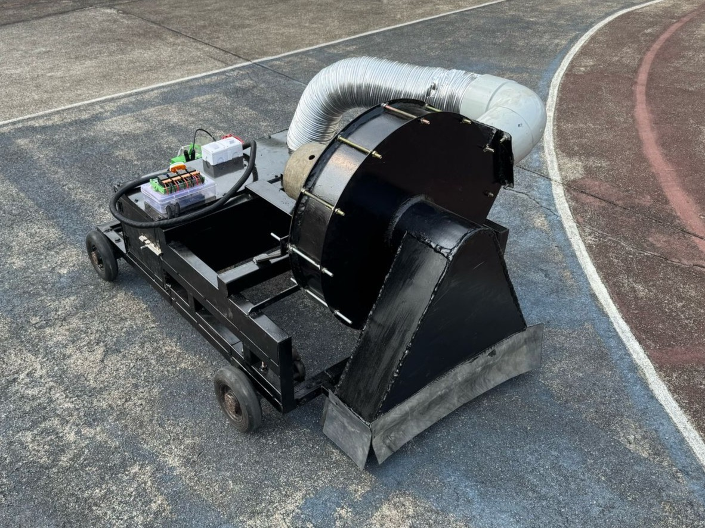
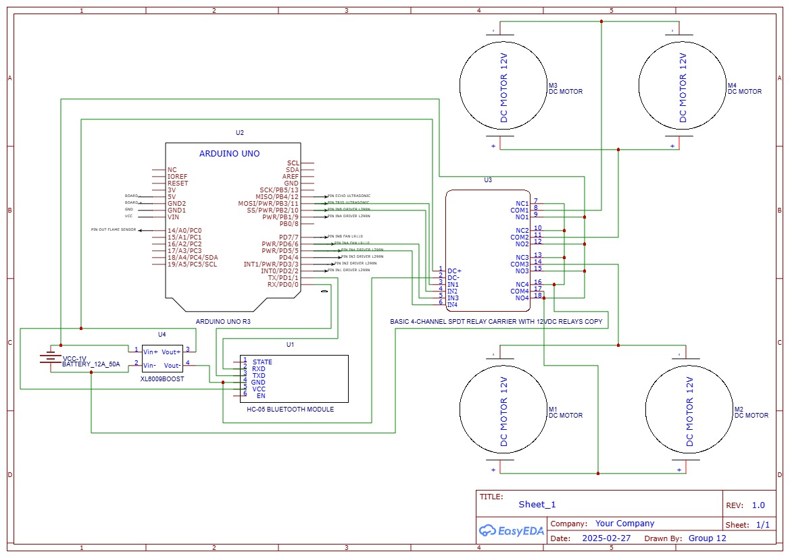

# 4WD-Mechatronic-Test-Platform
High-torque 4WD Vaccum Powered Leaf Collection vehicle featuring a 4-channel relay power-isolation system and Bluetooth-integrated control logic.
---

## 📸 Project Gallery
| High-Torque Chassis | Control Electronics |
| :--- | :--- |
|  |  |

> **Note:** Above are the 120W motors and the 30A relay switching system during the "Alpha" testing phase.
